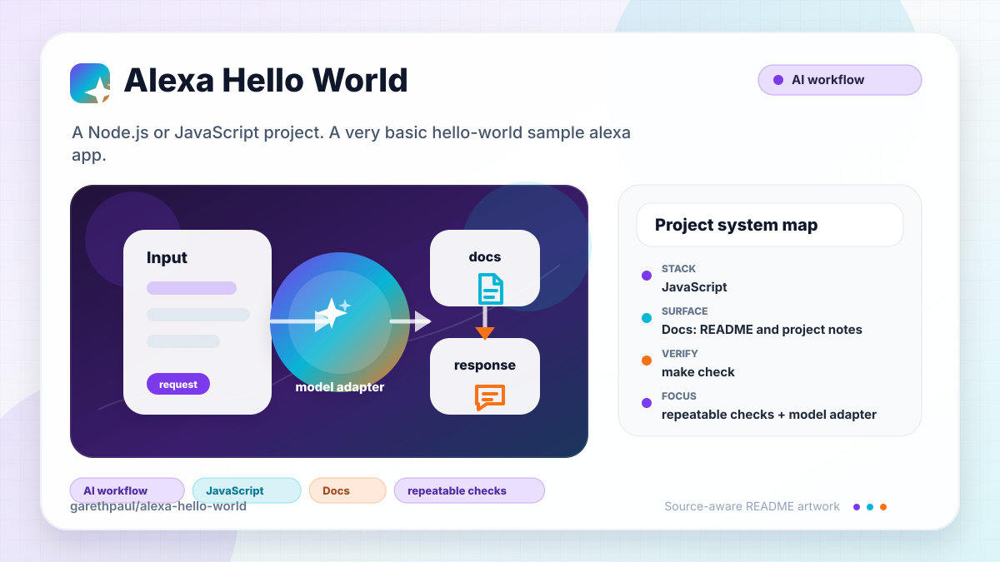

# alexa-hello-world

<!-- README-OVERVIEW-IMAGE -->



## Overview

`garethpaul/alexa-hello-world` is a Node.js or JavaScript project. A very basic hello-world sample alexa app.

This README is based on the checked-in source, manifests, scripts, and repository metadata on the `master` branch. The project language mix found during review was: JavaScript (4).

## Repository Contents

- `README.md` - project overview and local usage notes
- `package.json` - JavaScript dependency and script metadata
- `scripts/check-baseline.sh` - repository baseline and local metadata hygiene guard
- `.circleci` - source or example code
- `docs` - source or example code
- `package-lock.json` - JavaScript dependency and script metadata
- `SECURITY.md` - security reporting and disclosure guidance
- `speechAssets` - source or example code
- `src` - source or example code
- `test` - source or example code
- `VISION.md` - project direction and maintenance guardrails

Additional scan context:

- Source directories: .circleci, docs, speechAssets, src, test
- Dependency and build manifests: package-lock.json, package.json
- Entry points or build surfaces: package.json, scripts/check-baseline.sh
- Test-looking files: docs/plans/2026-06-08-alexa-testability-baseline.md, test/handler.test.js

## Getting Started

### Prerequisites

- Git
- Node.js 20.19 or newer and npm

### Setup

```bash
git clone https://github.com/garethpaul/alexa-hello-world.git
cd alexa-hello-world
npm ci
```

The setup commands above are derived from repository files. Legacy mobile, Python, or JavaScript samples may require older SDKs or package versions than a modern workstation uses by default.

## Running or Using the Project

- Inspect `package.json` for available npm scripts before running the project.

Detected npm scripts:

- `npm run build` - `node --check src/AlexaSkill.js && node --check src/index.js`
- `npm run format:check` - `prettier --check .`
- `npm run lint` - `eslint .`
- `npm run test` - `node --test`

## Testing and Verification

- `make check`
- `sh scripts/check-baseline.sh`
- `npm test`
- `make check` runs linting, formatting checks, tests, syntax checks, and the
  scripted repository baseline.
- `sh scripts/check-baseline.sh` verifies required files, npm scripts, Make
  targets, completed plan metadata, README verification notes, and local
  secret/editor ignore hygiene.
- GitHub Actions installs the locked dependency graph with `npm ci` and runs
  the same `make check` gate on Node 20, 22, and 24 for pull requests, pushes
  to `master`, and manual maintenance runs.
- CircleCI keeps the equivalent verification job for existing integrations.
- Handler tests cover launch, hello, help, cancel, stop, unsupported-intent,
  inherited intent-name rejection, session-ended, unsupported-request, inherited
  request-type rejection, malformed dispatch-key coercion, malformed-event,
  malformed-intent, and configured application-id rejection flows.
- Unsupported request types and intent names fail generically, without
  reflecting caller-controlled dispatch names into Lambda failures or logs.
- Malformed Alexa `session.attributes` values are reset to an empty object
  before response session attributes are built.
- Only owned Alexa session attributes are preserved. Missing, inherited, or
  malformed values are reset to an empty object before responses are built.

Use [`INTEGRATION_VERIFICATION.md`](INTEGRATION_VERIFICATION.md) for the
exact-commit non-production Lambda and Alexa matrix. It covers configuration,
trigger restriction, launch and intent flows, invalid requests, CloudWatch log
redaction, rollback, and explicit unexecuted results.

When the required SDK or runtime is unavailable, use static checks and source review first, then verify on a machine that has the matching platform toolchain.

## Configuration and Secrets

- No required secret or credential file was identified in the repository scan. If you add integrations later, keep secrets out of git.
- Local examples may omit `ALEXA_SKILL_ID`, but AWS Lambda initialization
  fails closed when the runtime-provided `AWS_LAMBDA_FUNCTION_NAME` is present
  and the skill ID is missing or blank. Configured values are trimmed before
  application-ID comparison.
- Routine handler logs avoid raw Alexa request IDs, session IDs, and configured
  or incoming application IDs.
- Top-level handler failures use a generic log message while preserving the
  original stack-bearing `Error` as a rejected promise.
- The promise-returning Lambda handler resolves with the existing Alexa
  response payload while preserving Lambda context for custom request handlers.
- The sample registers lifecycle behavior on a subclass-owned lifecycle handler table,
  leaving reusable `AlexaSkill` prototype defaults unchanged at module load.
- Alexa events must own an exact `version: "1.0"` protocol field before nested request validation.
- Alexa events must provide their own application identity chain through a
  non-empty string `session.application.applicationId` before optional skill-id
  comparison or request dispatch.
- Alexa events must provide their own request envelope before request type, ID,
  timestamp, or handler dispatch is evaluated.
- Intent requests must own their intent envelope before intent names are trusted.
- Alexa `request.type` and `intent.name` values must be non-empty strings before
  dispatch, so crafted objects cannot coerce into valid handler names.
- Every Alexa session must provide its own boolean `session.new` before request
  validation, authorization, or lifecycle dispatch.
- Every Alexa session must provide its own non-empty string `sessionId` before
  lifecycle validation, authorization, or dispatch.
- Every Alexa request must provide its own non-empty string `requestId` before
  timestamp validation, authorization, or dispatch.
- Alexa `request.timestamp` must be a valid ISO 8601 UTC value inside the
  inclusive 150-second freshness window before authorization or dispatch.
- Every Alexa request must own a non-empty string `request.locale` before lifecycle behavior, authorization, or dispatch.
- Rejected dispatch names are not included in failure diagnostics or logs,
  preventing embedded control characters from forging log entries.
- Primary and reprompt speech are validated before response construction.
  Supported output is a non-empty string or a `PlainText`/`SSML` options
  object; malformed output rejects before the Lambda handler resolves.
- Direct `SSML` output and reprompts must retain a trimmed `<speak>` envelope;
  mislabeled plain text or alternate roots fail before response construction.

## Security and Privacy Notes

- Review changes touching authentication or token handling; examples from the scan include docs/plans/2026-06-08-alexa-testability-baseline.md, src/AlexaSkill.js, src/index.js, test/handler.test.js.
- Review changes touching network requests, sockets, or service endpoints; examples from the scan include src/index.js.
- Review changes touching file, media, JSON, XML, CSV, OCR, or data parsing; examples from the scan include .circleci/config.yml, docs/plans/2026-06-08-alexa-testability-baseline.md.
- Review changes touching database, model, or persistence code; examples from the scan include docs/plans/2026-06-08-alexa-testability-baseline.md, src/index.js.
- Review changes touching infrastructure, proxy, cloud, or deployment configuration; examples from the scan include .circleci/config.yml, docs/plans/2026-06-08-alexa-testability-baseline.md.

## Maintenance Notes

- See `docs/plans/2026-06-14-alexa-integration-verification-checklist.md` for
  the cloud integration evidence matrix and runtime non-claims.

- See `SECURITY.md` for vulnerability reporting and safe research guidance.
- See `VISION.md` for project direction and contribution guardrails.
- See `docs/plans/2026-06-08-alexa-check-wrapper.md` for the root
  verification wrapper baseline.
- See `docs/plans/2026-06-09-alexa-event-shape-validation.md` for the
  malformed Alexa event validation contract.
- See `docs/plans/2026-06-09-alexa-application-id-type-validation.md` for the
  application-id string validation contract.
- See `docs/plans/2026-06-09-alexa-session-ended-contract.md` for the
  session-ended lifecycle contract.
- See `docs/plans/2026-06-09-alexa-log-identifier-redaction.md` for the
  log-identifier redaction contract.
- See `docs/plans/2026-06-09-alexa-skill-id-normalization.md` for the optional
  skill-id configuration contract.
- See `docs/plans/2026-06-09-alexa-session-attributes-normalization.md` for
  the session attributes normalization contract.
- See `docs/plans/2026-06-09-alexa-intent-own-property-dispatch.md` for
  intent dispatch own-property guarding.
- See `docs/plans/2026-06-09-alexa-request-own-property-dispatch.md` for
  request-type dispatch own-property guarding.
- See `docs/plans/2026-06-09-alexa-dispatch-key-type-validation.md` for
  dispatch-key string validation.
- See `docs/plans/2026-06-09-scripted-baseline-check.md` for the scripted
  repository baseline guard.
- See `docs/plans/2026-06-12-alexa-speech-output-validation.md` for response
  speech validation and regression coverage.
- See `docs/plans/2026-06-13-alexa-ssml-speak-envelope.md` for direct-response
  SSML root-envelope validation.
- See `docs/plans/2026-06-13-alexa-exception-log-redaction.md` for the boundary
  between generic failure logs and detailed Lambda errors.

## Contributing

Keep changes small and tied to the project that is already present in this repository. For code changes, document the toolchain used, avoid committing generated dependency directories or local configuration, and update this README when setup or verification steps change.
